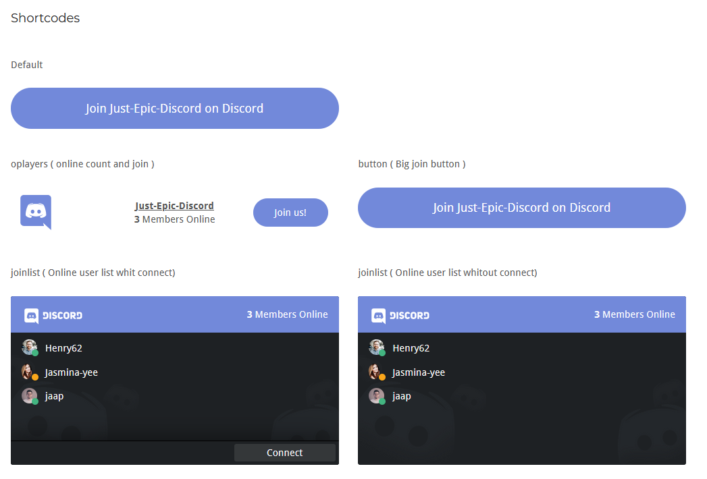

# Discord for WordPress
Discord Integration for WordPress
> Unofficial widget but whit respect for the discord guidelines

## Usage
- Instal and activate plugin
- add shotcode in text.

## Shortcodes



- Join button : [dfwp id="<discord server id>" type="button"]
- Online Players : [dfwp id="<discord server id>" type="oplayers"]
- Player list : [dfwp id="<discord server id>" type="list"]
- Player list whit join button : [dfwp id="<discord server id>" type="joinlist"]

*`Replace "<discord server id>" whit your server id`*

## ToDo
- [x] implement short codes
  - [x] Join button
  - [x] Online Players
  - [x] Player list 
  - [x] Player list whit join button
- [x] basic styling
  - [x] lists
  - [x] buttons
- [ ] Make plugin translatable
- [ ] clean up code
- [ ] add dark and light theme
- [ ] remove pre installed bugs

### Thinking about

- [ ]  color customization
- [ ]  Wordpress blocks
- [ ]  custom image in background list
- [ ]  list customization
- [ ]  branding

## Development
Compile sass command
```Shell
sass --watch dev/dfwp-style.scss:css/dfwp-style.css
```
include php libs
```Shell
composer install
```

## Suggestions or Issues?
- Add a feature request on the GitHub issues page
- Notify me for bugs "Yes Please"
- something missing here ??, let me know.
